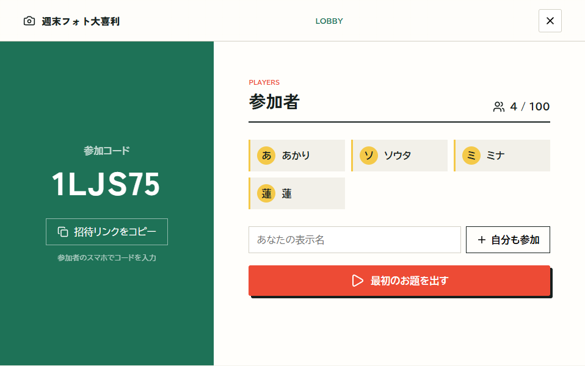
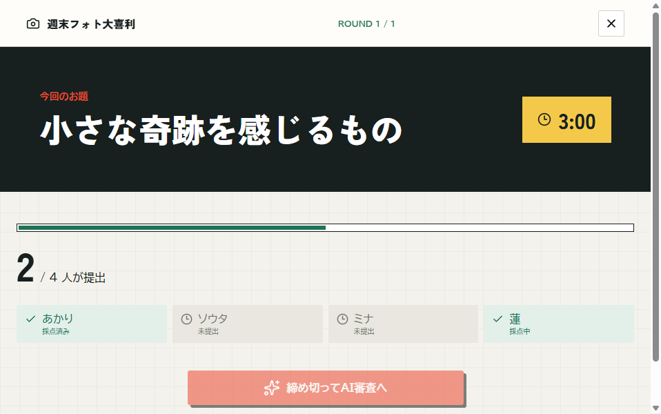
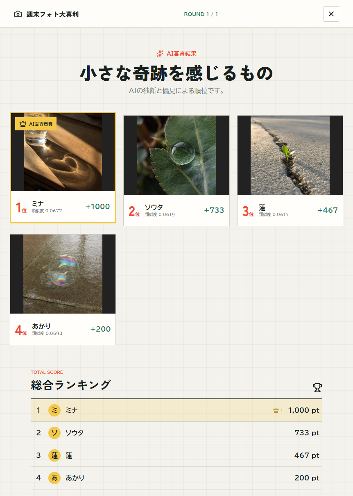

# AI 審査員フォト大喜利

SigLIP 2 のマルチモーダル埋め込みを、対戦ゲームとして体験できる Web アプリケーションです。
テキストで与えられた「お題」と参加者が提出した画像を同じベクトル空間へ埋め込み、その類似度で順位を決めます。

## 仕組み

SigLIP 2 でお題のテキストと各画像から特徴ベクトルを生成し、それぞれを L2 正規化したうえで内積を計算します。正規化後の内積はコサイン類似度に相当し、値が高い画像ほど「お題に近い」と判定されます。

$$
\mathrm{score}(t, i) = \frac{E_t(t)}{\lVert E_t(t) \rVert} \cdot \frac{E_i(i)}{\lVert E_i(i) \rVert}
$$

このスコアをラウンドごとの順位とポイントへ変換します。モデルが画像の面白さを生成的に評価するのではなく、埋め込み空間における「意味の近さ」がゲームの審査結果として現れる設計です。マルチモーダル埋め込みがテキストと画像をどのように対応づけるのかを、複数人で遊びながら体感できます。

ホストがルームを作成し、参加者は 6 桁のコードを使ってスマートフォンから参加します。最大 100 人に対応します。お題はプリセットからランダムに選ぶか、ホストが作成できます。

## プレイ画面

<table>
	<tr>
		<th>ルームへ参加</th>
		<th>ラウンド進行</th>
	</tr>
	<tr>
		<td></td>
		<td></td>
	</tr>
</table>

### AI 審査結果



掲載写真はデモ用に生成したものです。

## 技術構成

| 領域 | 技術 |
| --- | --- |
| フロントエンド | React 19、TypeScript、Vite |
| API | FastAPI、SQLAlchemy Async |
| 採点 | SigLIP 2、PyTorch |
| データベース | SQLite (ローカル)、Azure Database for PostgreSQL フレキシブル サーバー (Azure) |
| 画像ストレージ | ローカル ファイル、Azure Blob Storage |
| Azure | Azure Container Apps、Azure Queue Storage、マネージド ID |

## ローカル実行

Python 3.11 以降、[uv](https://docs.astral.sh/uv/)、Node.js、npm が必要です。

リポジトリのルートで API を起動します。

```powershell
uv sync
uv run photo-ogiri-api
```

別のターミナルでフロントエンドを起動します。

```powershell
cd frontend
npm ci
npm run dev
```

ブラウザーで <http://localhost:5173> を開きます。ローカルでは SQLite とローカル ファイルを使用するため、Azure への接続は不要です。

初回の採点時には、Hugging Face から約 1.3 GB の SigLIP 2 モデルをダウンロードします。2 回目以降はローカル キャッシュを使用します。

## テスト

```powershell
uv run pytest -q

cd frontend
npm ci
npm run lint
npm run build
```

API を起動した状態で、同時参加と画像提出の簡易負荷テストも実行できます。画像を指定しない場合は、テスト用の画像を自動生成します。

```powershell
uv run python scripts\poc_load_test.py --players 100 --skip-uploads
uv run python scripts\poc_load_test.py --players 20
```

## Azure へのデプロイ

サービス構成と採用理由については、[Azure アーキテクチャ](docs/architecture.md) を参照してください。

```powershell
# 課金リソースを作成せず変更内容を確認
.\infra\deploy.ps1 -ResourceGroup photo-ogiri -Location japaneast -Prefix photoogiri -WhatIfOnly

# デプロイ
.\infra\deploy.ps1 -ResourceGroup photo-ogiri -Location japaneast -Prefix photoogiri
```

## ライセンス

[MIT License](LICENSE)
