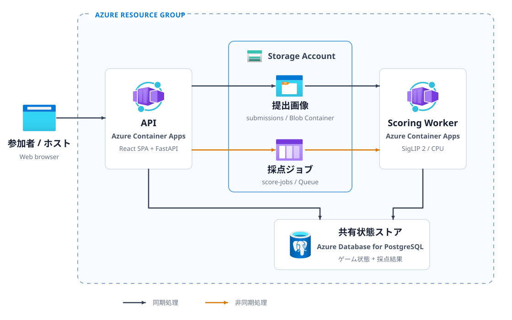

# Azure アーキテクチャ

本番環境では、Web API と SigLIP 2 の推論を Azure Container Apps 上の別アプリとして実行します。API と推論を分離し、画像提出が集中した場合もキューで処理量を平準化します。

図の `submissions` Blob コンテナーと `score-jobs` キューは、同じ Azure Storage アカウントに作成する子リソースです。失敗した採点ジョブを隔離する `score-jobs-poison` キューも同じアカウントに作成します。

## 処理フロー

1. API がゲーム状態を PostgreSQL に、提出画像を非公開の Blob Storage に保存します。
2. API が提出 ID を Queue Storage に送信し、推論を待たずに応答します。
3. 採点ワーカーがキューと Blob Storage から入力を取得し、SigLIP 2 で採点します。
4. 採点ワーカーがスコアを PostgreSQL に反映します。

## 非同期化

SigLIP 2 のモデル読み込みと画像推論は、通常の API 処理より多くの CPU、メモリ、処理時間を必要とします。同じプロセスで実行すると、採点中にルームへの参加や状態の取得も遅くなります。

API には 1 CPU と 2 GiB を割り当て、レプリカ数を 1 から 4 に設定します。採点ワーカーには 2 CPU と 4 GiB を割り当て、1 レプリカで運用します。API は HTTP 負荷に応じてスケールし、採点ワーカーはモデルをメモリに読み込んだままキューを処理します。お題の埋め込みもワーカー内でキャッシュします。

Queue Storage は、メッセージが少なくとも 1 回配信されることを前提とします。同じ提出が再配信されても二重に採点しないよう、PostgreSQL の行ロックと提出ステータスで処理を直列化します。5 回失敗したジョブは `score-jobs-poison` に移し、通常の採点処理から隔離します。

## Azure サービス

| サービス | 役割 | 採用理由 |
| --- | --- | --- |
| Azure Container Apps | API と採点ワーカーの実行 | Kubernetes クラスターを管理せず、API だけを負荷に応じてスケールできる |
| Azure Database for PostgreSQL フレキシブル サーバー | ゲーム状態とスコアの保存 | トランザクション、一意制約、行ロックで複数の API レプリカ間の競合を制御できる |
| Azure Blob Storage | 提出画像の保存 | バイナリ データをデータベースから分離し、非公開アクセスとライフサイクル管理を利用できる |
| Azure Queue Storage | API と採点ワーカーの仲介 | 推論を HTTP 要求から切り離し、提出の集中、再試行、ワーカーの停止を吸収できる |
| Azure Container Registry (ACR) | コンテナー イメージの保管とビルド | ローカルの Docker 環境を使用せずにイメージをビルドできる |
| ユーザー割り当てマネージド ID | ACR、Blob Storage、Queue Storage への認証 | 共有キーや管理者資格情報をアプリに渡さずに済む |
| Log Analytics ワークスペース | Container Apps のログ集約 | API と採点ワーカーのログを一元的に検索できる |

## セキュリティとデータ保持

- Blob コンテナーは公開せず、ブラウザーからの画像取得は API を経由します。
- Azure Storage アカウントの共有キーと ACR の管理者アカウントは無効にします。
- API と採点ワーカーには、同じユーザー割り当てマネージド ID を割り当てます。RBAC で `Storage Blob Data Contributor`、`Storage Queue Data Contributor`、`AcrPull` を付与します。
- 外部イングレスを設定するのは API だけです。
- データベース接続 URL は Container Apps のシークレットに保存します。
- 提出画像は最終更新から 7 日後に削除します。PostgreSQL のバックアップは 7 日間、Log Analytics のログは 30 日間保持します。

## 概念実証の制約

- 採点ワーカーは常時 1 レプリカです。モデルの再読み込みを避けられる一方、利用がない時間も課金されます。
- PostgreSQL はバースト可能な `Standard_B1ms` を使用し、高可用性と geo 冗長バックアップを無効にします。
- PostgreSQL は Azure サービスからの接続を許可し、パスワード認証を使用します。本番運用では、仮想ネットワーク統合、プライベート エンドポイント、Microsoft Entra 認証を検討します。
- 採点ワーカーは 1 レプリカで CPU 推論を実行します。採点待ち時間や同時開催数が増える場合は、キューの長さに応じたスケールや GPU 対応基盤を検討します。
- ブラウザーへの状態配信には WebSocket を使用せず、1.5 秒間隔でポーリングします。

## デプロイ

[`infra/main.bicep`](../infra/main.bicep) は、Azure Storage アカウント、PostgreSQL、Container Apps 環境、ACR、マネージド ID、Log Analytics、RBAC を作成します。[`infra/apps.bicep`](../infra/apps.bicep) は、API と採点ワーカーを Container Apps にデプロイします。

[`infra/deploy.ps1`](../infra/deploy.ps1) は、Bicep の検証、インフラストラクチャの作成、コンテナー イメージのビルド、`what-if`、アプリのデプロイを順番に実行します。

ローカル開発では Azure サービスを使用しません。PostgreSQL は SQLite、Blob Storage はローカル ファイル、Queue Storage と採点ワーカーは FastAPI のバックグラウンド処理に置き換えます。
